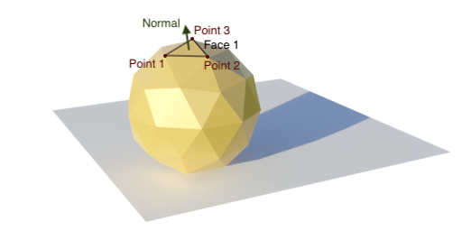
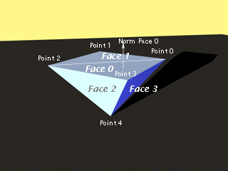

% Devoir noté -- Facettes : premières bases d'un programe d'infographie
% Jean-Cédric Chappelier &  Merlin Nimier-David
% Version 1.1 du 15 mars

(du 15 mars 2021, 12h00, au 30 mars, 23h59.)


# I. Introduction et instructions générales

Ce devoir noté consiste à écrire une petite application de gestion rudimentaire de « _facettes_ » permettant la représentation d'objets 3D. Typiquement en infographie, les facettes triangulaires sont les « polygones primitifs » le plus souvent utilisés pour modéliser des objets 3D plus ou moins complexes.

Nous vous demandons d'écrire tout votre code dans _un seul_ fichier nommé `facets.c` sur la base d'un fichier fourni, à compléter.

**Indications :** Si un comportement ou une situation donnée n'est pas définie dans la consigne ci-dessous, vous êtes libre de définir le comportement adéquat. On considérera comme comportement adéquat toute solution qui ne viole pas les contraintes données et qui ne résulte pas en un crash du programme.

**Instructions :**

1. Cet exercice doit être réalisé **individuellement !**
L'échange de code relatif à cet exercice noté est **strictement interdit !**
Cela inclut la diffusion de code sur le forum ou sur tout site de partage.

    Le code rendu doit être le résultat de _votre propre production_.
    Le plagiat de code, de quelque façon que de soit et quelle qu'en soit la source sera considéré comme de la tricherie (et peut même, suivant le cas, être illégal et passible de poursuites pénales).

    En cas de tricherie, vous recevrez la note « NA » pour l'entièreté de la branche et serez de plus dénoncés et punis suivant l'ordonnance sur la discipline.

2. Vous devez donc également garder le code produit pour cet exercice dans un endroit à l'accès strictement personnel.

    Le fichier (source !) `facets.c` à fournir comme rendu de ce devoir ne devra plus être modifié après la date et heure limite de rendu.

3. Veillez à rendre du code _anonyme_ : **pas** de nom, ni de numéro SCIPER, ni aucun identifiant personnel d'aucune sorte !

4. Utilisez le site Moodle du cours pour rendre votre exercice.

    Vous avez jusqu'au lundi 30 mars, 23:59 (heure du site Moodle du cours faisant foi) pour soumettre votre rendu.
    **Aucun délai supplémentaire ne sera accordé.**

Je tiens également à souligner que l'objectif de ce devoir n'est pas tant de vous évaluer que de vous entraîner. C'est pour cela que le coefficient de ce devoir est assez faible (10%). C'est également dans cet esprit qu'il a été conçu : de façon très progressive (de plus en plus difficile). Utilisez le donc comme un entraînement indicatif (sur lequel vous aurez un retour) en travaillant à votre niveau dans une durée qui vous semble raisonnable pour les crédits de ce cours (au lieu d'essayer de tout faire dans un temps déraisonnable). Ce coefficient (1 sur 10) n'est pas représentatif de la charge de travail (qui peut beaucoup varier à ce niveau d'un(e) étudiant(e) à l'autre), mais bien pour vous donner l'occasion d'avoir un premier retour sur votre niveau de programmation en C, sans prendre trop de « risques ».


# II. Contexte

Comme dit en introduction, les facettes triangles sont les « polygones
primitifs » utilisés pour modéliser des objets 3D plus ou moins
complexes.

Pour décrire ces facettes triangles, des points 3D sont tout d'abord
déterminés et numérotés. Ensuite, ces indices de points sont groupés par triplet pour
décrire un triangle. Cette dernière est aussi numérotée.



L'ordre des index des points d'une facette triangulaire est important car il
permet de déterminer la normale à cette face, comme nous le verrons plus bas.

La manière dont sont représentés les points 3D et les triangles en mémoire
doit permettre de retrouver facilement quels points appartiennent à quelles
faces et inversement. Notez qu'**un même point peut appartenir à plusieurs
faces**.

**Limitations** : étant donné que les allocations dynamiques n'ont pas encore été vues en cours au moment où ce sujet est donné, nous nous limiterons à des ensembles de données dont la taille maximale est petite et connue (allocation statique).
Cela nous permet de stocker tous les objets utilisées dans des tableaux de taille fixe. En pratique, tous ces tableaux devraient être gérés de façon dynamique (variation du nombre d'éléments contenus), mais cela n'est pas du tout demandé dans ce devoir.

**Vocabulaire** : "vertex" (pluriel: "vertices") signifie "sommet" en anglais.


# III. Utilisation & fonctionnalités

L'objectif principal de ce programme est d'afficher des informations concernant la forme décrite par l'utilisateur. En particulier, nous souhaitons pouvoir afficher:

- le nombre total de sommets et de facettes ;
- le barycentre, c'est à dire la moyenne de tous les sommets ;
- pour un sommet donné, le nombre de facettes auxquelles il appartient et leurs indices ;
- pour une facette donnée, le vecteur normal à cette facette et son aire.

Voici un **exemple de déroulement** du programme, que votre implémentation devra être capable de reproduire :

```
Combien de sommets ? 5
Sommet 0 : 0.0 2.0 -2.0
Sommet 1 : -2.0 2.0 0.0
Sommet 2 : 0.0 2.0 2.0
Sommet 3 : 2.0 2.0 0.0
Sommet 4 : 0.0 0.0 0.0

Combien de faces ? 6
Face 0 : 0 2 3
Face 1 : 0 1 2
Face 2 : 4 3 2
Face 3 : 0 3 4
Face 4 : 4 1 0
Face 5 : 4 2 1

La forme contient 5 sommets et 6 facettes.
Le barycentre est : (0, 1.6, 0)

Le sommet 000 appartient à 4 facettes : 000 001 003 004
Le sommet 001 appartient à 3 facettes : 001 004 005
Le sommet 002 appartient à 4 facettes : 000 001 002 005
Le sommet 003 appartient à 3 facettes : 000 002 003
Le sommet 004 appartient à 4 facettes : 002 003 004 005
Face 000 : aire = 4, normale = (0, 1, 0)
Face 001 : aire = 4, normale = (0, 1, 0)
Face 002 : aire = 3.464, normale = (0.5774, -0.5774, 0.5774)
Face 003 : aire = 3.464, normale = (0.5774, -0.5774, -0.5774)
Face 004 : aire = 3.464, normale = (-0.5774, -0.5774, -0.5774)
Face 005 : aire = 3.464, normale = (-0.5774, -0.5774, 0.5774)
```

# IV. Implémentation

Le fichier `facets.c` distribué contient un certain nombre de fonctions, dont certaines que nous vous demandons de compléter. (Commencez peut-être par jeter juste un coup d'oeil au fichier fourni pour avoir une idée).

Nous vous conseillons de procéder dans l'ordre suivant :

1. Implémentez les structures de données adaptées à ce problème (IV.1).
2. Écrivez les fonctions permettant de recevoir les données de l'utilisateur (IV.3).
3. Écrivez les fonctions traitant les données reçues (IV.3, suite).


## IV.1 Types

Le programme sera amené à manipuler un petit nombres de concepts, que nous vous proposons de représenter par des types et structures de données que les fonctions pourront ensuite utiliser. Il est important de choisir ces types avec attention, puisqu'ils pourraient rendre l'écriture des fonctions plus difficile que nécessaire.

Notez que certaines fonctions fournies utilisent déjà les types que vous allez définir : veillez donc à ce que ces fonctions compilent et fonctionnent comme prévu, sans les modifier.

Vous devez définir (au moins) les types suivant :

- `Vector`: structure contenant les trois coordonnées réelles `x`, `y`, `z` d'un vecteur 3D.
- `Vertex`: structure représentant un des sommets de la forme. Un sommet peut appartenir à plusieurs facettes. Elle doit contenir (au moins) les coordonnées du sommet et une référence vers chaque facette le contenant (au plus `NB_FACETS_PER_VERTEX_MAX` facettes).
- `Facet`: structure représentant une facette triangulaire. Doit contenir (au moins) une référence vers chacun de ses trois sommets.


## IV.2 Fonctions fournies

Avant de décrire plus bas le travail à faire, nous présentons ici les fonctions déjà fournies.

### Fonction `main()`

La fonction `main()` appelle les diverses fonctions (dont celles que vous aurez définies) afin de les tester:

1. Obtient les sommets et facettes de la part de l'utilisateur,
2. Imprime certaines statistiques sur la forme,
3. Imprime les infos des `MAX_PRINT` premier sommets (au plus),
4. Imprime les infos de toutes les faces.

Utilisez donc ce `main()` fourni pour faire tous les tests qui vous semblent utiles (typiquement en regardant les résultats produits dans des cas bien spécifiques que vous aurez jugé pertinent de choisir).

Pensez également à tester (par vous-mêmes) chacune de vos fonctions, progressivement.


### Fonctions d'impression

Les fonctions `print_mesh_stats`, `print_vertex_info` et `print_face_info` impriment les informations décrites plus haut (III).
Afin de faciliter la correction, veuillez **respecter exactement l'ordre et le formattage** donné dans l'exemple de déroulement. Pour vous aider, la plupart des messages sont déjà présents dans le code fourni.


## IV.3 Fonctions à implémenter

**Remarque :** dans ce devoir, il n'est pas demandé d'implémenter chaque fonction de manière algorithmiquement optimale. Grâce à la petite taille des formes traitées, une fonction de complexité même quadratique devrait tout de même terminer presque instantanément. (Mais ne faites pas pire que quadratique, tout de même ! `;-)`)

### Fonctions `query_vertices` et `query_facets`

Une fonction permettant à l'utilisateur de spécifier tout
d'abord le nombre de points 3D `nb_vertices` à entrer, et ensuite d'introduire
les trois coordonnées réelles de chaque point. Par convention, les points sont numérotés par ordre d'entrée (de 0 à `nb_vertices - 1` inclus).

Traitez l'introduction des triangles de manière similaire (référez vous à l'exemple donné en section III pour le déroulement exact).

Stockez toutes ces informations dans les structures de données définies plus haut.

N'oubliez pas de vérifier que les valeurs données sont bien valides. Par exemple, les indices des sommets d'une facette doivent toujours correspondre à un des sommets préalablement renseignés.

En cas d'erreur, vous devez imprimer un message décrivant le problème et immédiatement retourner le nombre de sommets (ou faces) qui ont été correctement traités jusque là. L'objectif est de permettre au reste du programme de s'exécuter "aussi bien que possible".
Par exemple, le déroulement suivant est correct malgré une erreur dans la dernière facette :

```
Combien de sommets ? 3
    Vertex 0 ? 0 0 0
    Vertex 1 ? 0 1 0
    Vertex 2 ? 0 0 1
Combien de facettes ? 3
    Face 0 ? 0 1 2
    Face 1 ? 1 2 3
Erreur: les indices des sommets doivent être entre 0 et 2

La forme contient 3 sommets et 1 facettes.
Le barycentre est : (0, 0.3333, 0.3333)

Le sommet 000 appartient à 1 facettes : 000
Le sommet 001 appartient à 2 facettes : 000 001
Le sommet 002 appartient à 2 facettes : 000 001
Face 000 : aire = 0.5, normale = (1, 0, 0)
```


### Fonction `facet_normal`

La fonction `facet_normal` permet, pour un indice
de triangle donné, de calculer le vecteur normal à cette facette.
La normale d'une facette est un vecteur perpendiculaire au plan de
cette face. Il est obtenu par le produit vectoriel des deux premiers
vecteurs `(Point1-Point0)` et `(Point2-Point1)`.

**Remarque**: le produit vectoriel de deux vecteurs $\vec{a}$ et $\vec{b}$ se
calcule selon la formule suivante:

$$
\overrightarrow{a} \times \overrightarrow{b}
    = (a_yb_z-a_zb_y)\vec{\imath}
      + (a_zb_x-a_xb_z)\vec{\jmath}
      + (a_xb_y-a_yb_x)\vec{k}
$$

Par convention, le vecteur normal doit être normalisé, c'est à dire que sa norme euclidienne doit être égale à 1.

Pour tester votre programme, utilisez les points et les faces suivantes,
formant une pyramide sur pointe comme illustré par la figure ci-dessus,
laquelle correspond à l'exemple de déroulement fournis précédemment.



Par ailleurs, cette fonction doit stocker l'aire de la facette triangulaire dans la variable pointée par `out_area`, si le pointeur n'est pas `NULL`.<br>
**Indice**: le calcul de l'aire peut s'appuyer sur des termes utilisés dans le calcul de la normale.

Pour une meilleure organisation, nous conseillons de créer les fonctions-outil suivantes :

- `vertices_to_vector`: retourne un vecteur pointant d'un sommet à un autre,
- `vector_product`: retourne le produit vectoriel de deux vecteurs,
- `vector_norm`: retourne la norme d'un vecteur.


### Fonction `mesh_barycenter`

Cette fonction doit simplement retourner le barycentre (= la moyenne) de tous les points enregistrés.

### Fonction `print_vertex_info`

Cette fonction doit être complétée pour afficher le nombre de voisins du sommet donné, puis leurs indices. Veillez à respecter le format des examples de déroulement ci-dessus.


# V. Quelques conseils pour terminer

N'hésitez pas à créer d'autres fonctions utilitaires si nécessaire.

Tout votre code et toutes vos fonctions doivent être robustes tant que faire se peut.

Pensez à tester correctement chacune des fonctionnalités implémentées à **chaque** étape et **avant** de passer à l'étape suivante. Cela vous évitera bien des tracas.

Pour tester efficacement un exemple sans avoir à entrer les données à la main à chaque essai, vous pouvez utiliser la redirection de flux : 

    ./facets < tests/exemple1.txt

Si vous avez `diff` (ou `colordiff`) d'installé(s), vous pouvez même comparer le résultat :

    ./facets < tests/example1.txt > output.txt
    diff -wB tests/example1.out output.txt 
 
